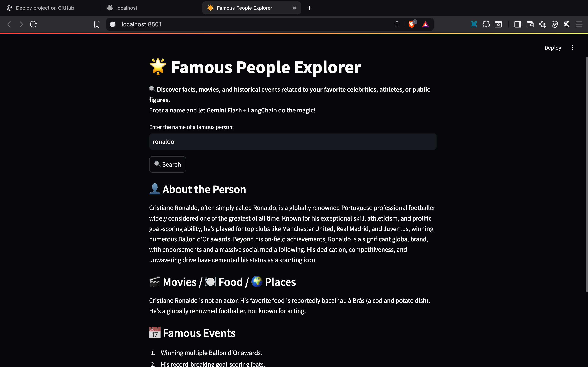

# 🌟 Famous People Explorer

A smart and interactive web app built using **Streamlit**, **LangChain**, and **Google Gemini 1.5 Flash**. It helps you explore quick facts, movies, food, travel suggestions, and historical events related to famous personalities.

---

## 🔍 Features

- 🔎 Search for any **famous person** (celebrity, actor, athlete, etc.)
- 🧠 Automatically generates:
  - A 100-word short biography
  - 🎬 3 movies (if actor), 🍽️ favorite food (if sportsperson), 🌍 favorite travel destinations (otherwise)
  - 📅 5 global events related to the person
- 🤖 Uses **LangChain SequentialChain** to generate intelligent responses
- ⚡ Powered by **Gemini 1.5 Flash (Google Generative AI)**
- 🧑‍💻 Interactive UI built with **Streamlit**

---

## 🛠️ Tech Stack

- Python 🐍
- [Streamlit](https://streamlit.io/)
- [LangChain](https://www.langchain.com/)
- [Google Generative AI (Gemini)](https://ai.google.dev/)
- [langchain-google-genai](https://pypi.org/project/langchain-google-genai/)

---

## 📁 Project Structure
search_persons/
├── myenv/ # Virtual environment (ignored)
├── constants.py # Contains your Gemini API key (not uploaded)
├── main.py # Streamlit app
├── requirements.txt # All dependencies
└── README.md # This file


## 🔍 App Preview




---

## ⚙️ Setup Instructions

### 1. Clone the Repository

```bash
git clone https://github.com/pankaj9599/famous-people-explorer.git
cd famous-people-explorer

Install Dependencies

pip install -r requirements.txt


Add Your Gemini API Key

Option A: Using constants.py (already used in code)
# constants.py
gemini_key = "your-google-gemini-api-key"

Option B (Alternative): Use .env with dotenv
# .env
GOOGLE_API_KEY=your-google-api-key

streamlit run main.py
# famous-people-explorer
